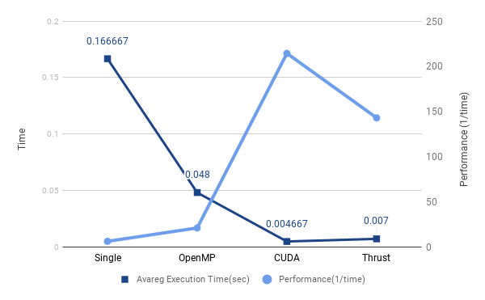

#  Raytracing

Project is raytracing example using multicore.

This project implemented below versions.

- Single threaded
- OpenMP
- CUDA
- Thrust

## Requirement

- 64bit Windows
- Visual Studio 2017
  - VC++ 2015.3 v14.00 (v140) toolset for desktop
- CUDA v9.2(or later version)
  - use CUDA version has thrust library.
  - CUDA_PATH have to set in Environment variable

## CUDA Setting

Must follow step 5 in [How to build CUDA toolkit projects in Visual Studio 2017](https://www.olegtarasov.me/how-to-build-cuda-toolkit-projects-in-visual-studio-2017/).

If don't use CUDA v9.2, in `<RepoDir>/cuda/cuda.vcxproj` and `<RepoDir>/thrust/thrust.vcxproj`, change value `CUDA 9.2.props` and `CUDA 9.2.targets`  to installed CUDA Version.

## Compile

Recommend to use Visual Studio 2017. After Build Solution or Project, VS2017 make execution files into `<RepoDir>/x64/Release/` or `<RepoDir>/x64/Debug/`.

If you want compile in VS2017 command prompt, see below section.

`<RepoDir>` means top level directory in repository.

## Result


### Execution Time

Execution time is average value over 3 execution times.

Tested on Windows 10 x64, AMD Ryzen 1700X and GTX 760.

| Version | execution time(s) |
| --- | --- |
| Single thread | 0.166667 |
| OpenMP | 0.048 |
| CUDA | 0.004667 |
| Thrust | 0.007 |




## Single threaded Raytracing

### Compile

At `<RepoDir>/single-thread/`, compile with MSBuild

```batch
msbuild single-thread.vcxproj /p:configuration=Release
```

Or with `cl.exe`

```batch
cl /Ox /Fe: "single-thread.exe" <single-thread.cpp>
```

For example, if current directory is `<RepoDir>/single-thread/`, `cl /Ox /Fe: "single-thread.exe" .\single-thread.cpp`.

### Execution

If compile with VS2017, execution file locate `<RepoDir>/x64/(Debug|Release)/single-thread.exe`.

If compile with MSBuild, execution file locate `<RepoDir>/single-thread/x64/(Debug|Release)/single-thread.exe`.

If compile with cl, execution file locate current directory.

Change directory to location of execution file, run below command to execute.

```batch
single-thread.exe .\result.ppm
```

## OpenMP Raytracing

### Compile

At `<RepoDir>/openmp/`, compile with MSBuild

```batch
msbuild openmp.vcxproj /p:configuration=Release
```

Or with cl

```batch
cl /Ox /openmp /Fe: "openmp.exe" <openmp_ray.c>
```

For example, at `<RepoDir>/openmp/`, compile command is `cl /Ox /openmp /Fe: "openmp.exe" .\openmp_ray.c`.

### Execution

If compile with VS2017, execution file locate `<RepoDir>/x64/(Debug|Release)/openmp.exe`.

If compile with MSBuild, execution file locate `<RepoDir>/openmp/x64/(Debug|Release)/openmp.exe`.

If compile with cl, execution file locate current directory without additional option(usually current directory).

Change directory to location of execution file, run below command to execute.

```batch
openmp.exe <number threads> <result.ppm>
```

For example,

```batch
openmp.exe 8 .\result.ppm
```

## Thrust Raytracing

### Compile

At `<RepoDir>/thrust/`, compile with MSBuild

```batch
msbuild thrust.vcxproj /p:configuration=Release
```

Or with nvcc

```batch
nvcc -x cu --machine 64 --optimize 3 --output-file thrust.exe <thrust_ray.cu>
```

### Execution

If compile with VS2017, execution file locate `<RepoDir>/x64/(Debug|Release)/thrust.exe`.

If compile with MSBuild, execution file locate `<RepoDir>/thrust/x64/(Debug|Release)/thrust.exe`.

If compile with cl, execution file locate current directory without additional option(usually current directory).

Change directory to location of execution file, run below command to execute.

```batch
thrust.exe <result.ppm>
```

like `thrust.exe .\result.ppm`

## CUDA Raytracing

### Compile

At `<RepoDir>/cuda/`, compile with MSBuild

```batch
msbuild thrust.vcxproj /p:configuration=Release
```

Or with nvcc :

```batch
nvcc -x cu --machine 64 --optimize 3 --output-file cuda.exe <cuda_ray.cu>
```

### Execution

If compile with VS2017, execution file locate `<RepoDir>/x64/(Debug|Release)/cuda.exe`.

If compile with MSBuild, execution file locate `<RepoDir>/cuda/x64/(Debug|Release)/cuda.exe`.

If compile with cl, execution file locate current directory without additional option(usually current directory).

Change directory to location of execution file, run below command to execute.

```batch
cuda.exe <result.ppm>
```

such as `cuda.exe .\result.ppm`

